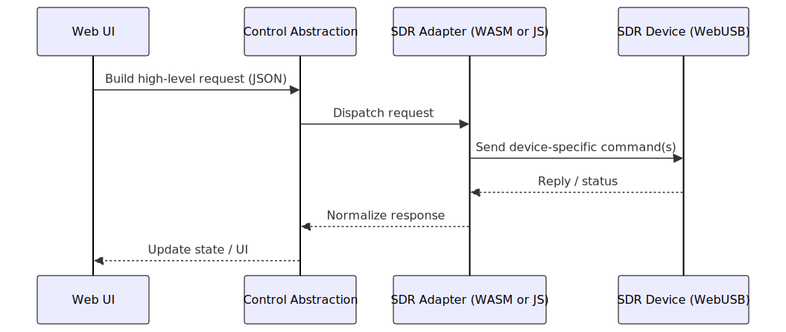

# SDR Interaction Architecture

This document describes the architecture of the **SDR interaction subsystem**
within WebSDR.

The subsystem enables direct interaction with SDR hardware from the browser
and operates entirely on the frontend.

---

## Architectural Principles

- **In-browser execution** (control + streaming run in the browser process)
- **No required server-side/control-plane services** for SDR interaction
- **Direct WebUSB access**
- **Driver-based hardware abstraction**
- **Real-time IQ streaming**

---

## High-Level Architecture

The SDR interaction subsystem consists of three logical layers:

1. Web Application Interface
2. SDR Control Abstraction
3. SDR and Signal Processing

All layers execute inside the browser and communicate through in-process APIs.

The following diagram shows the **control request pipeline**: the web UI issues a high-level request, the control abstraction serializes/validates it, and a concrete driver performs device-specific operations over WebUSB.

The next diagram shows the same system as **layers** (what runs where, and which boundary hides device-specific details). 

---

## Web Application Interface

This layer represents the API surface exposed to the web application.

### Responsibilities

- Issue high-level SDR commands
- Control the SDR lifecycle
- Consume IQ data streams

The web application does not interact with hardware directly.

### Execution Model

- One browser tab controls exactly one SDR device
- Multiple tabs may control multiple SDRs concurrently
- No shared SDR state exists between tabs

---

## SDR Control Abstraction

The control abstraction layer defines a unified, device-agnostic command model.

### Responsibilities

- Define high-level SDR commands
- Normalize and validate parameters
- Dispatch commands to device drivers
- Enforce command ordering and lifecycle rules

This layer does not perform USB or hardware access.

In the current implementation, command dispatch is serialized via a queue to avoid concurrent control transactions colliding.

---

## SDR Layer

This layer is where **radio hardware becomes IQ data**.

### Scope

- SDR hardware
- Device-specific drivers (WASM or JavaScript)
- Minimal, device-centric signal preprocessing

This layer is typically implemented by a concrete driver that subclasses the shared WebUSB base class and implements:

* Packet sizing/alignment (RX/TX)
* IQ decode/encode
* Request/response transport (`sendCommandToDevice`)

### Responsibilities

- Apply SDR configuration (frequency, bandwidth, sample rate, gains)
- Control streaming lifecycle
- Produce IQ data streams in defined formats

---

## Data Flow

1. Web application issues a high-level SDR command
2. Command is validated and dispatched
3. Driver applies configuration to the SDR
4. SDR streams IQ samples
5. IQ data is delivered to frontend consumers

All steps occur entirely in the browser.

## Message formats (recommendation)

- Streaming payload: sequence of fixed-size packets containing a small header (sequence number, timestamp, sample format), followed by I/Q samples in interleaved format.
- Sample formats: prefer `INT16` (signed 16-bit, interleaved I,Q) for bandwidth and browser TypedArray compatibility. Allow `FLOAT32` when high dynamic range required.
- Control messages: JSON for readability on control endpoint; binary TLV for minimal-latency/embedded-constrained devices.

## Notes on “remote” drivers

Some deployments use a satellite/proxy driver to control SDR hardware on another machine.
Those flows may use remote-session lifecycle commands (discover/connect/disconnect), but they are intentionally out of scope for this WebUSB-focused documentation.

