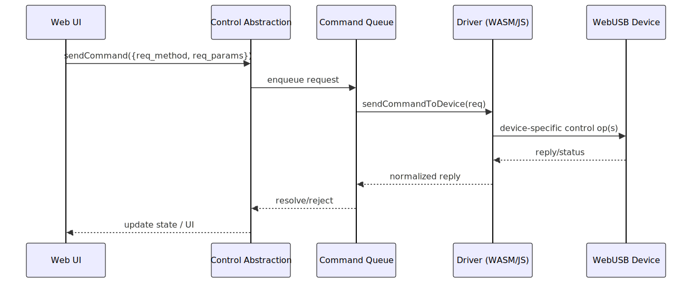

# SDR Interaction via WebUSB

## Overview

This document describes how Software Defined Radio (SDR) devices are integrated, controlled, and interacted with in WebSDR **directly from the browser** using WebUSB.

The SDR interaction subsystem described here is **frontend-only**: control and IQ streaming run inside the browser process without any required backend services.

The document focuses on:

* The architectural model used to expose SDR functionality in the browser
* Data and control flows between components
* Abstractions used to decouple hardware‑specific details from the web UI
* Typical interaction scenarios (tuning, streaming, control)

## Design Goals

The SDR interaction layer is designed with the following goals in mind:

* **Web‑first**: All SDR functionality must be accessible from a standard web browser
* **Hardware abstraction**: The platform should support multiple SDR backends with minimal changes
* **Low latency**: Real‑time signal streaming and control feedback are critical
* **Multi-instance**: Multiple tabs may control multiple SDR devices concurrently
* **Testability**: Signal paths and control interfaces should be testable without physical hardware

## Scope and non-goals

This document focuses on **local WebUSB devices** controlled by a browser tab.

Out of scope (intentionally not described here):

* Remote or distributed deployments where an SDR is controlled via a “satellite”/proxy driver running on another machine (e.g. RPi5).
* Remote-session lifecycle commands such as `sdr_discover`, `sdr_connect`, `sdr_disconnect`. These exist for specialized remote drivers but are not part of the local WebUSB interaction flow.

## High‑Level Architecture

At a high level, WebSDR separates SDR interaction into three logical layers that all run **inside the browser**:

1. **Web Client (Browser)**
2. **SDR Control Abstraction**
3. **SDR Driver + Device (WebUSB)**

Each layer communicates through well‑defined in-process interfaces, allowing independent evolution and easier debugging.

The diagram below summarizes the **frontend-only layering** and boundaries between the UI, control abstraction, and the driver/device.

## Web Client Layer

The web client runs entirely in the browser and is responsible for:

* User interaction (frequency tuning, gain control, mode selection)
* Visualization (spectrum, waterfall, demodulated audio)
* Initiating and controlling SDR sessions

### Responsibilities

* Send control commands (e.g. frequency, sample rate, gain)
* Receive streamed IQ data (and send TX IQ when supported)
* Render UI components in real time

## SDR Control Abstraction

This layer defines the **device-agnostic** control model exposed to the UI and higher-level logic.

### Responsibilities

* Define high-level SDR commands and their parameter schemas
* Normalize/validate parameters before dispatch
* Serialize command execution (ordering, mutual exclusion)
* Dispatch requests to a concrete driver and normalize responses

The control abstraction is what makes the UI mostly independent from a specific SDR model.

## SDR Driver + Device Layer (WebUSB)

This layer interfaces directly with the SDR hardware via WebUSB and performs device-specific framing/encoding.

### Responsibilities

* Configure SDR hardware (frequency, bandwidth, gains, samplerate)
* Start/stop streaming and exchange IQ packets
* Decode/encode device-native packet framing into a common buffer format

### Driver implementations

Drivers can be implemented as:

* **WASM-based adapters** (C/C++/Rust → WebAssembly) for reuse of native code or higher performance
* **JavaScript/TypeScript adapters** for lightweight or purely-web implementations

## Data Flow

A typical data flow for receiving a signal looks like this:

1. User selects frequency/mode in the web UI
2. UI sends a high-level request to the control abstraction
3. Control abstraction validates and dispatches the request to the active driver
4. Driver applies the configuration via WebUSB control transfers / WASM control module
5. Driver starts streaming and receives IQ packets via WebUSB bulk transfers
6. Decoded IQ buffers are delivered to frontend consumers (spectrum/waterfall/audio)

## Error Handling and Diagnostics

Errors are propagated explicitly across layers:

* Driver-level failures are converted into structured replies (`result`, `error`, optional `details`)
* The control abstraction normalizes thrown exceptions vs structured device errors
* The UI presents user-friendly messages while retaining technical details for debugging

Logging and metrics are collected at each layer to simplify troubleshooting and performance analysis.

## Security Considerations

* WebUSB permissions are origin-scoped and require explicit user selection
* Each browser tab typically controls one device instance (no shared cross-tab state by default)
* Command serialization and queue limits prevent runaway TX buffering

## Extensibility

The interaction model is designed to be extensible:

* New SDR backends can be added by implementing the common SDR interface
* New signal‑processing blocks can be inserted without changing the control protocol
* UI components can evolve independently of hardware support

## SDR Control Abstraction and Command Model

The wsdr.io platform exposes SDR control through a unified, high-level command interface. This interface defines a fixed set of abstract requests that represent common SDR operations such as tuning, gain control, streaming control, calibration, and device management.

Each request consists of:

* A **method name** (`req_method`) that identifies the logical SDR operation
* An optional set of **parameters** (`req_params`) describing the operation inputs
* Optional binary payload data (`req_data`) for operations such as flash programming

This command model is intentionally device-agnostic and does not expose USB-level or vendor-specific details to the web application.

For the full command catalog and category reference, see the dedicated file: [SDR Command Catalog](commands.md).

### Typical device lifecycle

A minimal “happy path” for a **local WebUSB** SDR session:

1. **Select device** using the browser WebUSB chooser (permission prompt)
2. **Open/claim** the device in the driver (`open()` / driver-specific initialization)
3. **Configure** (as needed) using high-level commands:

   * `sdr_set_rx_frequency`, `sdr_set_rx_bandwidth`, `sdr_set_rx_gain`
   * TX equivalents when needed
4. **Start streaming**: `sdr_init_streaming`
5. **Runtime adjustments** (optional):

   * `sdr_ctrl_streaming`
   * change frequency / gains while streaming (if supported by the device)
6. **Stop streaming**: `sdr_stop_streaming`
7. **Close/release** the device (`close()`)

Note: remote-session lifecycle commands (discover/connect/disconnect) are intentionally not covered in this WebUSB-focused document.

### Control-to-device translation pipeline

The web application emits high-level requests. A device adapter translates them into SDR-specific control operations. Current supported SDRs use WASM-based adapters (C → WebAssembly), while other SDRs may use pure JavaScript adapters.

The first diagram shows the **logical control translation flow** (UI → abstraction → adapter/driver → device).

The second diagram shows the **runtime command dispatch mechanics** (queueing/serialization and request/response normalization).

### RX Control Commands

Receive-side control commands include:

* Setting RX frequency, bandwidth, and gain
* Querying RX stream statistics

These commands operate on explicitly defined channel identifiers and are designed to be applicable across different SDR hardware implementations.

### TX Control Commands

Transmit-side commands mirror the RX model and include:

* TX frequency configuration
* TX bandwidth configuration
* TX gain control (including multi-channel operation)

The symmetry between RX and TX commands simplifies UI logic and reduces hardware-specific branching in the frontend.

### Connection and Streaming Control

Common commands manage streaming behavior:

* Stream initialization and shutdown
* Runtime streaming control (sample rate, throttling, and auxiliary parameters)

Streaming commands explicitly define data format, packetization, and direction (RX, TX, or duplex), allowing predictable performance characteristics.

### Generic Parameters and Sensors

To support hardware-specific extensions without breaking the abstract model, the interface includes generic accessors:

* `sdr_get_parameter` / `sdr_set_parameter` for hierarchical device parameters
* `sdr_get_sensor` for querying runtime measurements (e.g. temperature)

This mechanism allows advanced features to be exposed without expanding the core command set.

### Calibration and Diagnostics

The abstraction layer also includes commands for:

* Device calibration
* Debug state dumps

These commands are intended for development, diagnostics, and factory-level workflows.

### Flash and Persistent Storage Access

For devices that support on-board non-volatile storage, the model defines explicit flash access commands:

* Flash read
* Flash erase
* Flash sector write with checksum validation

These operations are exposed in a controlled manner and are not required for basic SDR operation.

### Adapter Implementations

High-level control requests are translated into device-specific operations by pluggable adapters:

* **WASM-based adapters**, implemented in C and compiled to WebAssembly, are used for current supported SDR devices
* **JavaScript-based adapters** may be used for other devices, such as pure-JS SDR implementations

This separation allows the command model to remain stable while enabling flexible support for different SDR backends.

## Command Lifecycle

A typical SDR interaction follows a well-defined lifecycle:

1. **Select device** – User selects a local device via the WebUSB chooser
2. **Open/claim** – Driver opens/claims the device and initializes transport
3. **Configuration** – Apply RX/TX parameters (frequency, bandwidth, gains, sample rate)
4. **Streaming Start** – Initialize IQ streaming with explicit format and packetization
5. **Runtime Control** – Adjust parameters dynamically while streaming
6. **Streaming Stop** – Gracefully stop data flow
7. **Close/release** – Driver releases the device and associated resources

This lifecycle is enforced at the frontend level and does not rely on any backend coordination.

For command categories and the full command catalog see: [SDR Command Catalog](commands.md).

## Sequence Diagram (Conceptual)

The following conceptual sequence illustrates a typical control interaction:

* UI component issues a high-level SDR request
* The abstract control layer validates and normalizes the request
* A device-specific adapter translates the request into SDR-native commands
* The SDR device applies the configuration and returns a structured response

The same flow applies regardless of whether the adapter is implemented in WebAssembly or JavaScript.

## Implementing a Custom SDR Driver

The wsdr.io platform allows developers to add support for new SDR hardware by implementing a custom SDR driver. This is achieved by inheriting from a common base driver class and implementing a small set of abstract methods.

### Driver Model

Each SDR driver:

* Owns the WebUSB device handle
* Exposes a uniform, high-level control interface
* Translates abstract commands into device-specific operations

The web application interacts exclusively with the abstract interface and is unaware of the concrete SDR implementation.

### Required Driver Responsibilities

A custom driver implementation is expected to:

* Handle device open/close and transport initialization
* Apply RX and TX configuration commands
* Start and stop IQ streaming
* Report errors and status in a structured form

### Abstract Command Dispatch

The base driver defines an internal command-dispatch mechanism responsible for delivering control requests to the device and returning structured responses.

In the current design, command dispatch is abstracted via a driver hook (e.g. `sendCommandToDevice(req)`), allowing each driver to define its own transport and mapping strategy:

* WASM-backed drivers may forward JSON requests into a WASM control module and parse JSON replies
* Pure-JS drivers may implement request handling without WASM
* Some drivers may use USB control transfers with binary payloads internally, while still exposing a stable high-level request model to the UI

### WebAssembly and JavaScript Drivers

Driver implementations may be provided as:

* **WebAssembly-based drivers**, typically written in C/C++ and compiled to WASM, suitable for high-performance or existing native SDR codebases
* **JavaScript-based drivers**, suitable for lightweight SDR implementations or environments where native code is not required

Both approaches are first-class citizens and are supported by the same abstract driver interface.

## Writing your own SDR driver

wsdr.io is designed so that adding a new SDR backend is primarily an adapter/driver task. A new driver typically:

* Inherits from a common base class (e.g., a WebUSB-oriented base)
* Implements a small set of abstract methods to:

  * **open/close** the device
  * **configure** RX/TX parameters (frequency, bandwidth, sample rate, gains)
  * **start/stop** streaming
  * **exchange control messages** (request/response)

### Minimal responsibilities of a driver

A practical checklist for a driver implementation:

1. **Transport**

   * Implement the low-level device transport (WebUSB endpoints, transfers, timeouts).
2. **Command translation**

   * Map the high-level request catalog (JSON) into the device’s native command set.
3. **Streaming**

   * Provide a consistent stream output contract (IQ sample format, packetization assumptions, flow control).
4. **Error model**

   * Convert device-specific failures into structured errors understood by the frontend.

### Custom JSON request handling

Some WASM-based drivers use a helper that sends a JSON request to a WASM control module and parses a JSON reply:

* It serializes the request with `JSON.stringify`
* Allocates request/response buffers in WASM memory
* Calls an exported WASM function (e.g., `send_command`) asynchronously
* Parses the returned JSON response

In practice, not all SDR backends will want this exact mechanism. For example:

* A pure-JS SDR backend may not use WASM at all
* Some devices may need a different request encoding or multi-step command sequences
* Some devices may return binary replies, not JSON

In the codebase, the transport/mapping hook is already abstracted at the driver level, so each driver can choose the most appropriate strategy while keeping the high-level request catalog stable.

## Conclusion

The SDR interaction model in WebSDR is built around a frontend-only architecture with a clear separation between abstract control commands and device-specific implementations. By combining WebUSB access, a unified command interface, and pluggable adapters (WASM or JavaScript), the platform enables high-performance, real-time SDR operation directly in the browser while remaining extensible and hardware-agnostic.
